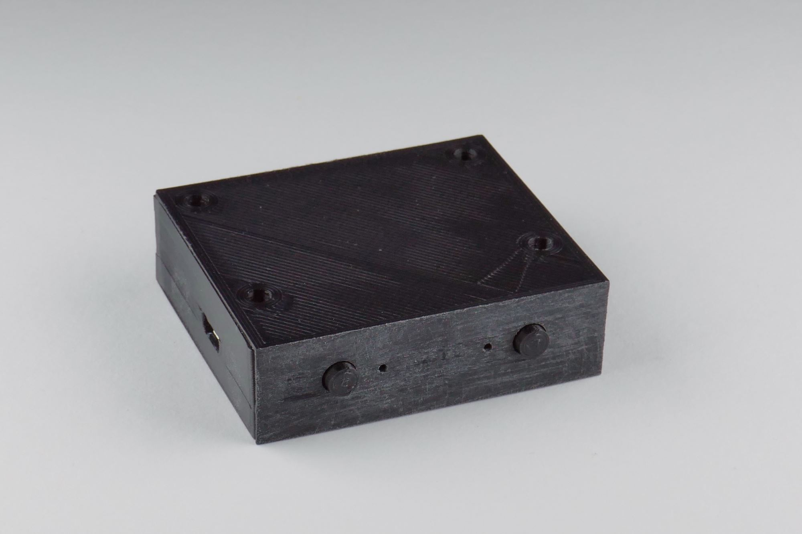
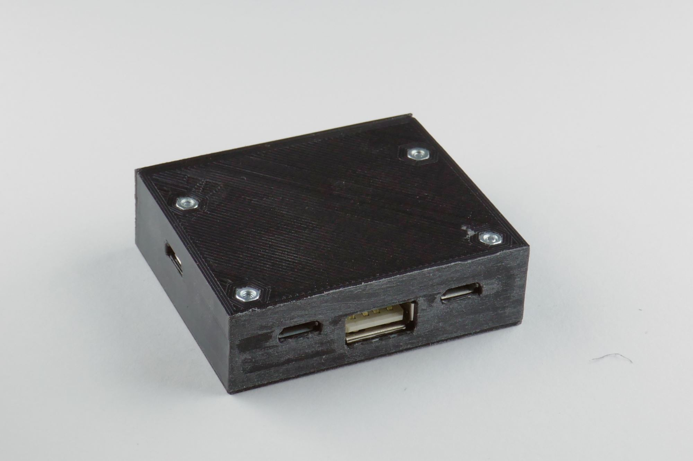
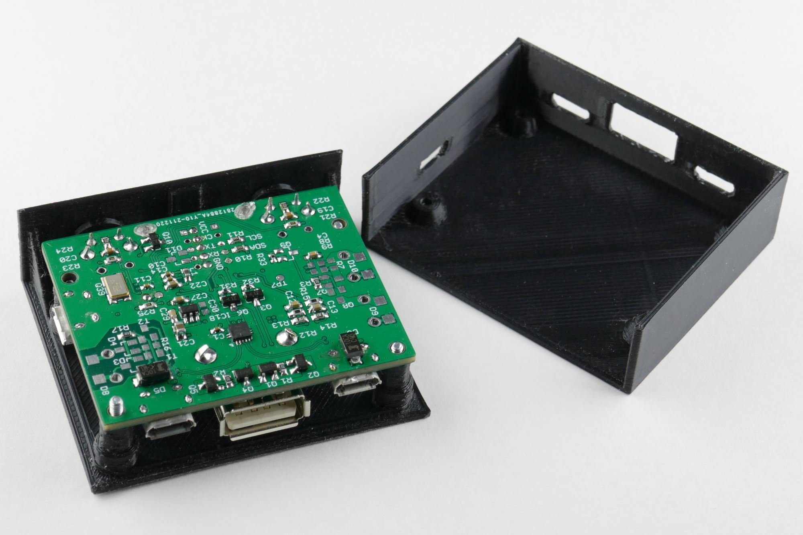
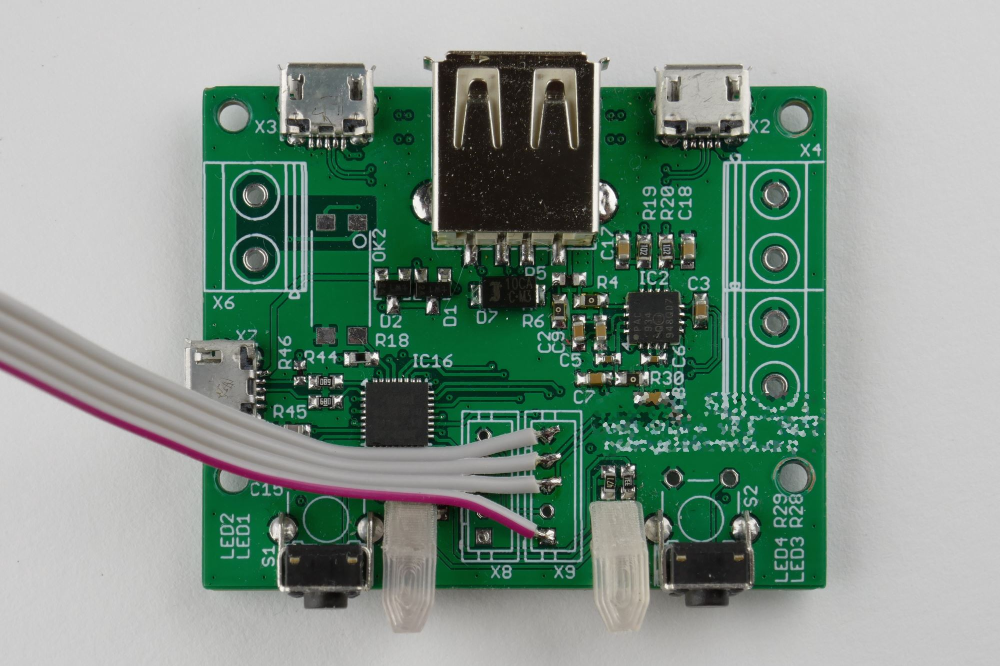
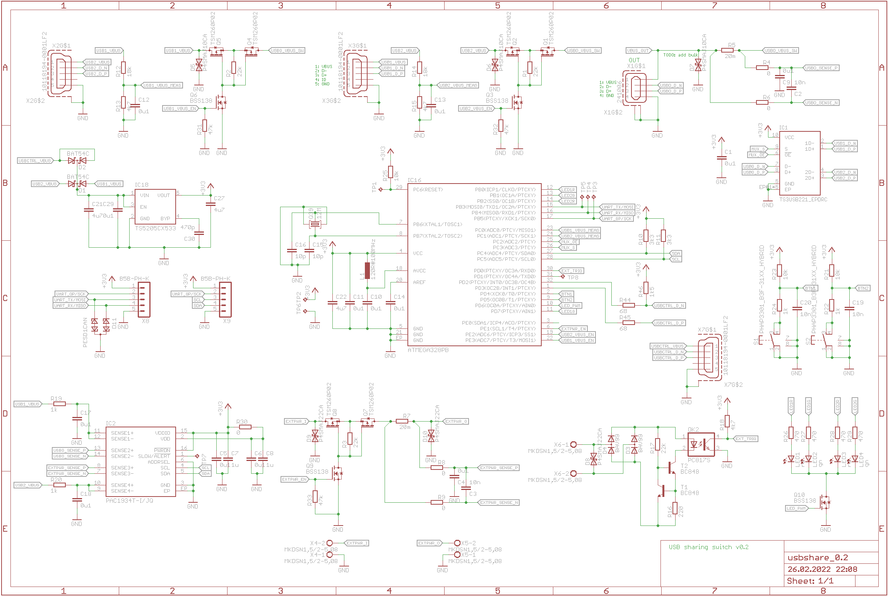

# USB sharing switchs

Almost 2 years ago (as of end of February 2022), I switched to mostly working from home. Having a more than adequate setup, I hooked up my work notebook's dock to my after hours battlestation.

In the first days, I kept unplugging/plugging the connectors - afraid of wearing them, I soon got a 10 bucks USB sharing switch of eBay, which is ok but not as [comfortable as expected](https://hobbyelektronik.org/b/2020/05/homeoffice/) (German only).

If you don't like something, do better:

## Hardware
* USB switch: TI TS3USB221
* Microcontroller: Microchip ATmega328PB
* Current sensor: Microchip PAC1934
* Power switches: Taiwan Semi TSM260P02 (2x26mR)
* Opto-isolated control input (not tested yet)
* Switchable Aux port (not tested yet)
* 2 Buttons + red/green LEDs each
* Connectors for I²C and UART
* Management USB port (currently only bootloader support)

### Schematics

## Software features

The feature set of the USB switch can be configures in usbswsm.c

* Automatic source selection
  * First available after startup
  * First available
  * Auto change when connected
  * Auto change when disconnected
* Manual source select
  * Allow select disconnected channel
  * Allow disconnect all ports (longpress left button)

Software support for the PAC1934 is available and tested but not used, yet.

The management interface is not implemented.

### Bootloader

The bootloader is based in [BootloadHID](https://www.obdev.at/products/vusb/bootloadhid.html), fits in 2K words of memory and hasthe following extension:
The bootloader is automatically entered when no firmware is installed, when the left button is pressed when the device is powered up, as well as when 0xDEADBEEF is written to a designated RAM address and the device is put in reset.

## Mechanics

The housing is (poorly) designed in OpenSCAD and measures 55x16.4x47.3 mm³.
The light guides were made in Sketchup.

Both designs were aligned to be printed on an Ender 3. The Housing works fine at 0.2 mm layer height, the light guides seem to work best with minimal layer height (using transparent PLA).

The screws used are M2 with 12 mm length.

The light guides can be heatstaked with a soldering iron (fillet tip) at 250 °C

## Improvements, TODOs and planned features
* Implement USB management interface (and host software - likely python)
* Implement OLED display
* Translate light guides to OpenSCAD-design and improve
* Add mounting points to housing
* Add holes for terminals
* Reduce light leaks between indicators and at the bottom of the housing
* improve mounting of button faceplates